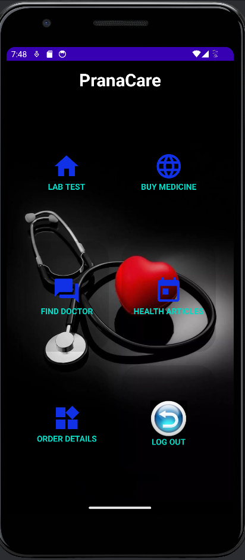
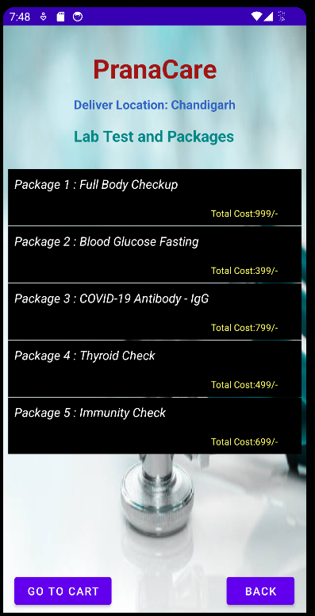
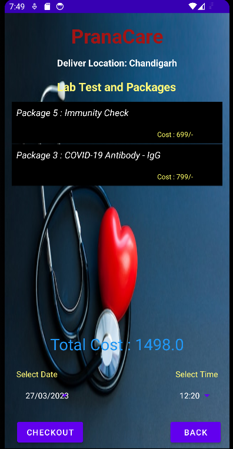
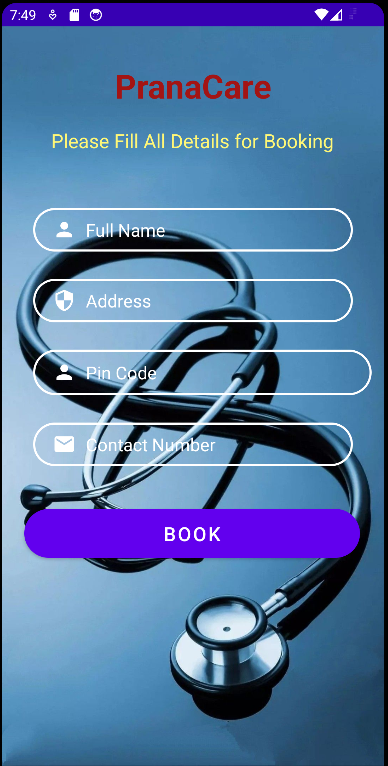
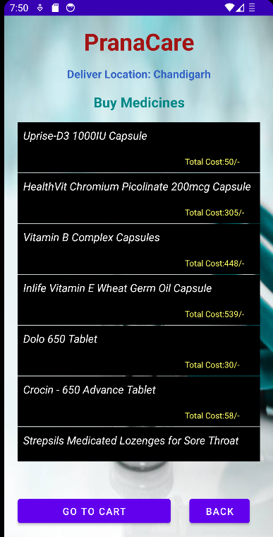

<h1 align="center">HealthCare-Application</h1>
<h2>Application Interface</h2>

<h3 > Our platform provide various services like booing an appointment for doctors regular check up. It also provides users to order medicines online.
Through this user can also book lab test from their residence.</h3>
<h3>MoreOver, Users can also read health articles for healthy life.</h3>

